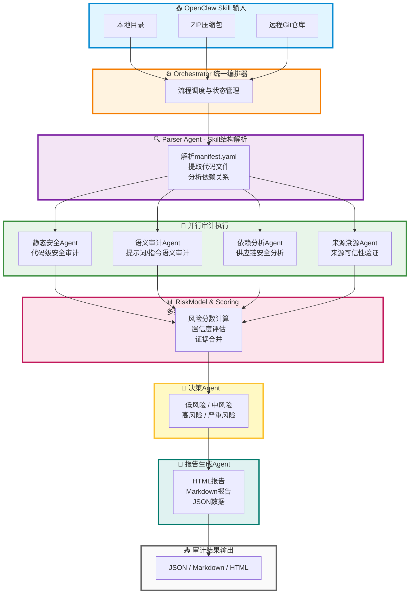

# OpenClaw Skill Risk Platform - 审计流程架构图

## Mermaid 流程图



## 流程说明

### 1. 📥 输入层
支持多种 Skill 包输入方式：
- **本地目录**：直接扫描本地文件系统
- **ZIP压缩包**：解压后进行分析
- **远程Git仓库**：克隆远程仓库进行审计

### 2. ⚙️ 编排层
**Orchestrator 统一编排器**负责：
- 审计任务的调度和协调
- 各阶段状态管理
- 错误处理和重试机制
- 异步任务队列管理

### 3. 🔍 解析层
**Parser Agent** 执行 Skill 结构解析：
- 解析 `manifest.yaml` 配置文件
- 提取所有代码文件和资源
- 分析依赖关系树
- 构建审计上下文

### 4. 🔄 并行审计层
四个专业 Agent **并行执行**审计任务：

#### 静态安全 Agent
- 文件权限检查
- 危险命令检测（rm -rf, curl | bash等）
- 敏感路径访问（/etc/shadow, ~/.ssh等）
- 可疑网络请求分析

#### 语义审计 Agent
- Prompt 注入攻击检测
- 指令意图分析
- 社会工程学风险识别
- 恶意诱导行为检测

#### 依赖分析 Agent
- 依赖树构建
- 版本冲突检测
- 已知CVE漏洞匹配
- 供应链投毒风险评估

#### 来源溯源 Agent
- Git仓库信誉度评估
- 数字签名验证
- 作者身份可信度分析
- 历史行为追踪

### 5. 📊 评分层
**RiskModel & Scoring** 进行多维度风险评分聚合：
- 综合各 Agent 的证据
- 计算加权风险分数（0-100）
- 评估置信度水平
- 生成风险热力图

### 6. 🎯 决策层
**决策 Agent** 根据评分结果判定风险等级：
- 🟢 **低风险** (0-30)：可安全使用
- 🟡 **中风险** (31-60)：需人工审查
- 🟠 **高风险** (61-85)：建议隔离运行
- 🔴 **严重风险** (86-100)：禁止使用

### 7. 📄 报告层
**报告生成 Agent** 输出多格式审计报告：
- **HTML报告**：可视化图表、交互式界面
- **Markdown报告**：易于分享和版本控制
- **JSON数据**：便于程序化处理和集成

### 8. 📤 输出层
最终审计结果以标准化格式输出，支持：
- API 接口返回
- 文件导出
- 数据库持久化
- 前端可视化展示

---

## 技术实现要点

### 异步并发
- 使用 `asyncio` 实现并行审计
- 通过 `TaskQueue` 管理工作负载
- 支持批量审计任务处理

### 规则引擎
- YAML 格式的可配置规则
- 支持自定义规则扩展
- 热更新无需重启服务

### LLM 集成
- OpenAI SDK 调用大语言模型
- 用于语义分析和意图识别
- 智能风险推理和解释生成

### 数据存储
- SQLAlchemy ORM 抽象数据库操作
- 支持 SQLite/PostgreSQL
- 审计记录永久化存储

---

## 如何使用此图表

### 方法1：在线转换
1. 访问 [Mermaid Live Editor](https://mermaid.live/)
2. 复制上面的 Mermaid 代码
3. 点击 "Actions" → "Download PNG/SVG"

### 方法2：VS Code 插件
1. 安装 "Markdown Preview Mermaid Support" 插件
2. 在 VS Code 中打开此文件
3. 右键预览 → 导出为图片

### 方法3：命令行工具
```bash
# 安装 mermaid-cli
npm install -g @mermaid-js/mermaid-cli

# 转换为 PNG
mmdc -i audit-flowchart.md -o audit-flowchart.png

# 转换为 SVG
mmdc -i audit-flowchart.md -o audit-flowchart.svg
```

### 方法4：Python 生成
```python
import mermaid

# 使用 Python 库生成图片
chart = mermaid.Mermaid(your_mermaid_code)
chart.to_png('audit-flowchart.png')
```

---

**生成时间**: 2026-04-22  
**项目版本**: OpenClaw Skill Risk Platform v1.0
